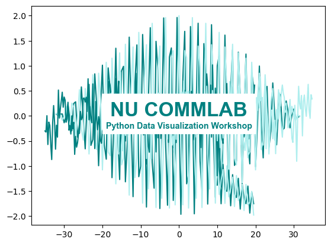

# Northeastern University CommLab Workshop Series: Automating Your Data Visualization Process with Python

    

A three-day workshop designed to teach researchers the basics of Python plotting and data visualization from the ground up. This series is primarily designed for those with little to no experience in Python. Over the course of three sessions, we'll demonstrate how to setup and interact with a user-friendly Python plotting environment before walking through the basics of importing and plotting your data.

For those who aren't able to attend the workshop live, links to recorded workshop sessions for each day are provided and accessible to current Northeastern students.

## Day 1: Tools of the Trade and System Setup
- Installing Miniconda and VSCode
- Setting up your Python environment with data visualization tools
- Interactive Python plotting using Jupyter Notebooks

## Day 2: Getting Comfortable with Python for Data Illustration
- Basic Python plotting with Matplotlib [(Walkthrough Recording)](https://northeastern.hosted.panopto.com/Panopto/Pages/Viewer.aspx?id=86631461-23fa-44f7-adbf-b448010ba52c)
- Plotting examples with full tutorials

## Day 3: Importing Your Data for Tailored Visualization
- Using Pandas for data management
- Putting it all together with Seaborn

### Provided by the Northeastern University COE CommLab:
- [CommLab Website](https://coe.northeastern.edu/orgs/nu-coe-commlab/)
- [Book a One-on-one](https://outlook.office365.com/book/CivilandEnvironmentalCommLab@northeastern.onmicrosoft.com/?ismsaljsauthenabled=true) (For Northeastern University Students)

### Data Sources:
- Tatum, James; Punia, Ambuj; Kostiuk, Larry; Secanell, Marc; Olfert, Jason (2022), *“Methane pyrolysis products in a constant-volume reactor as a function of time”*, Mendeley Data, V1, doi: 10.17632/3d4yftz66n.1
    - [Open Access Article](https://www.sciencedirect.com/science/article/pii/S2352340923000719)
    - [Open Access Dataset](https://data.mendeley.com/datasets/3d4yftz66n/1)
    - [CC BY 4.0 License](https://creativecommons.org/licenses/by/4.0/)
